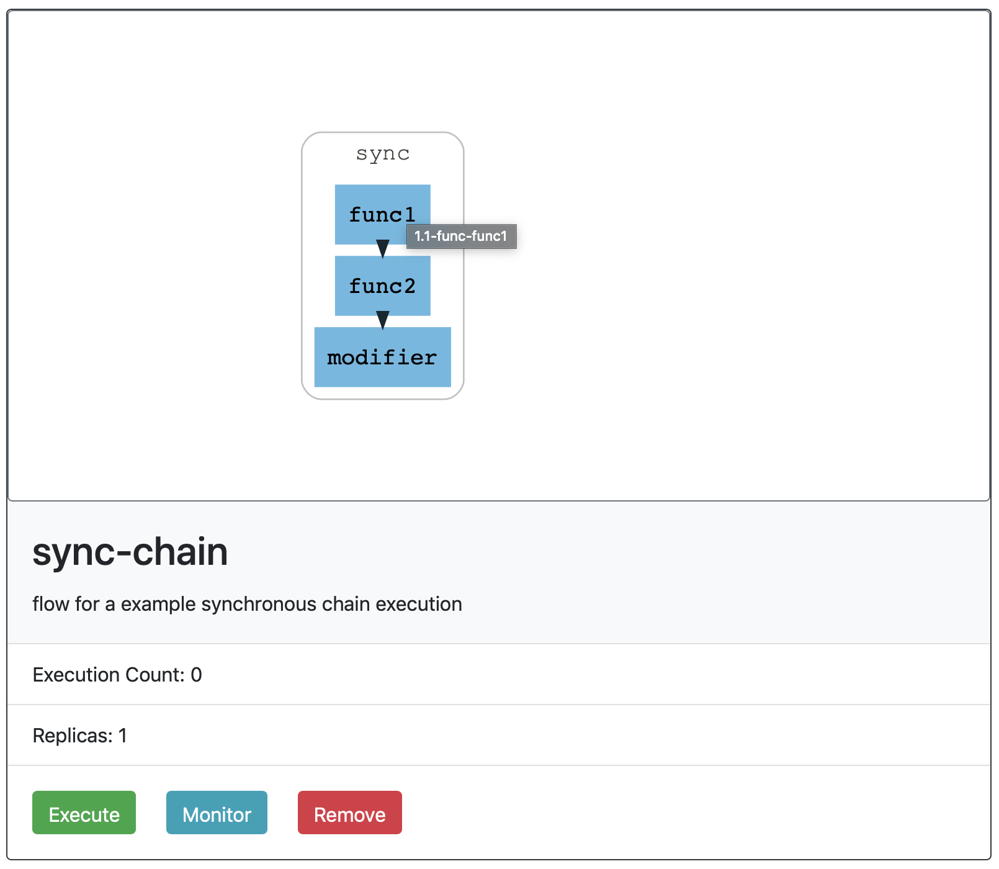
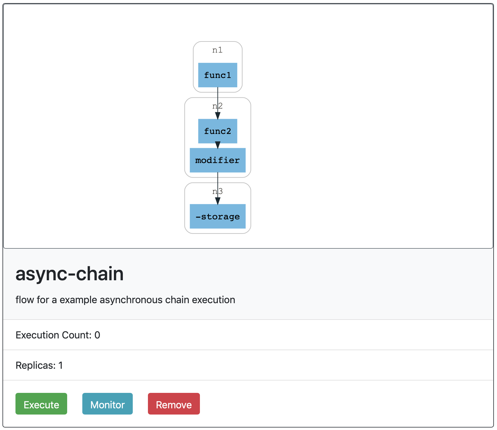
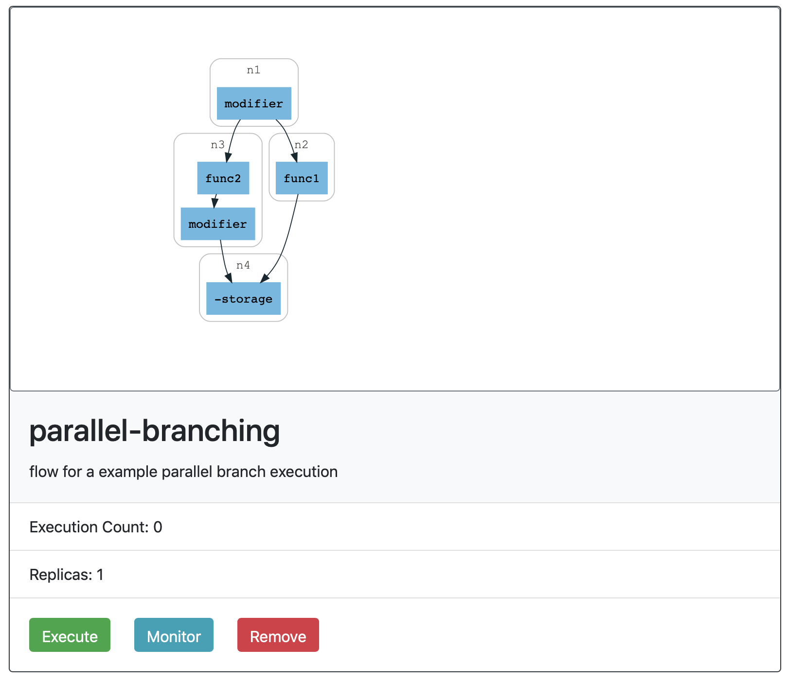
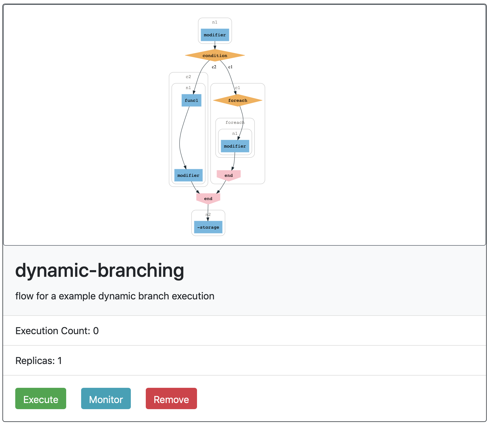
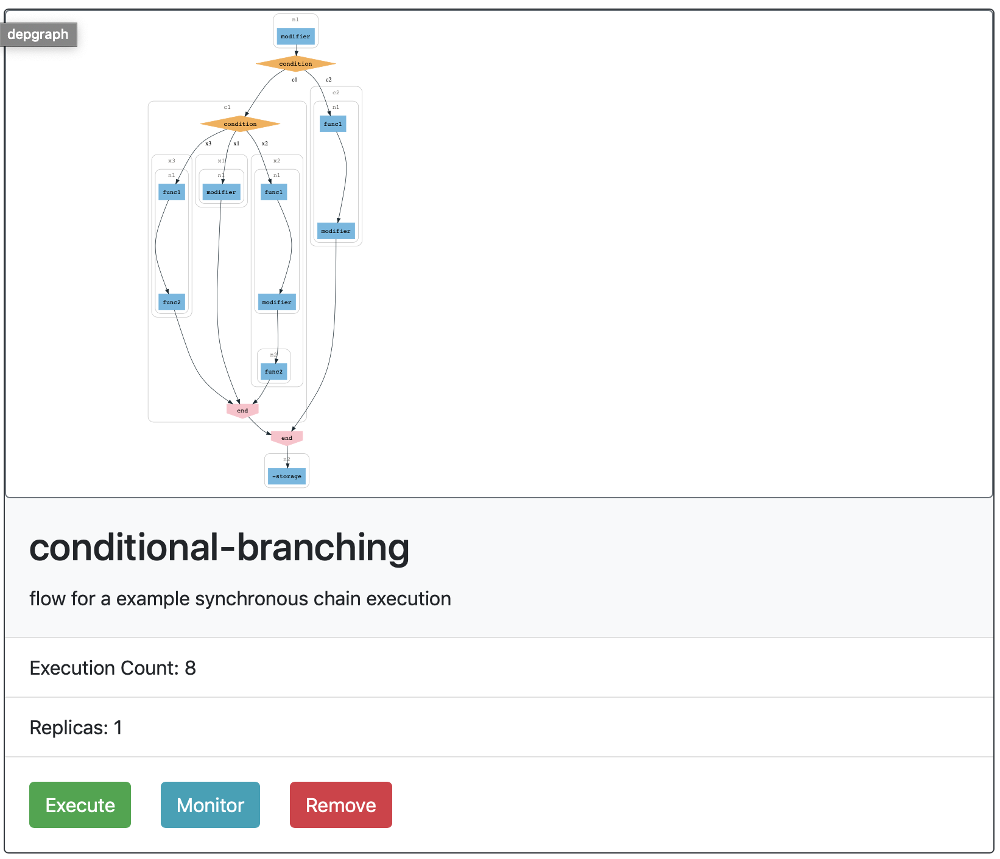
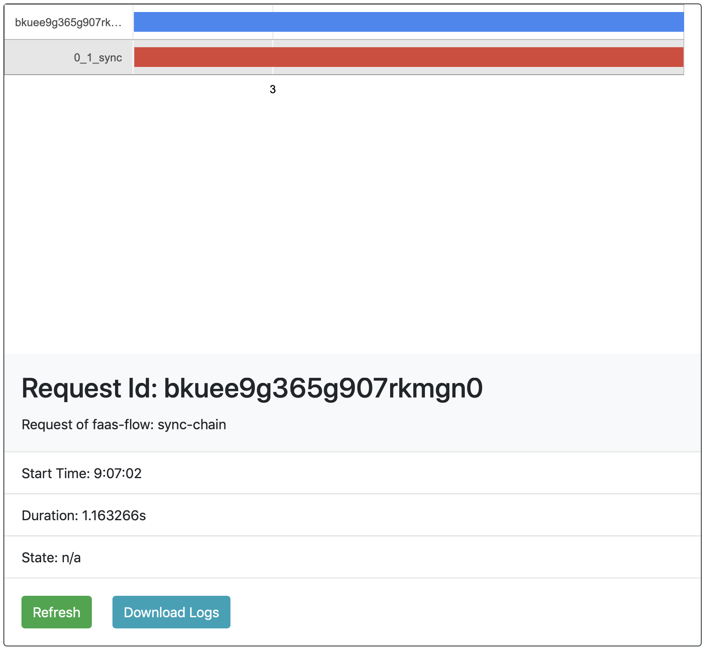
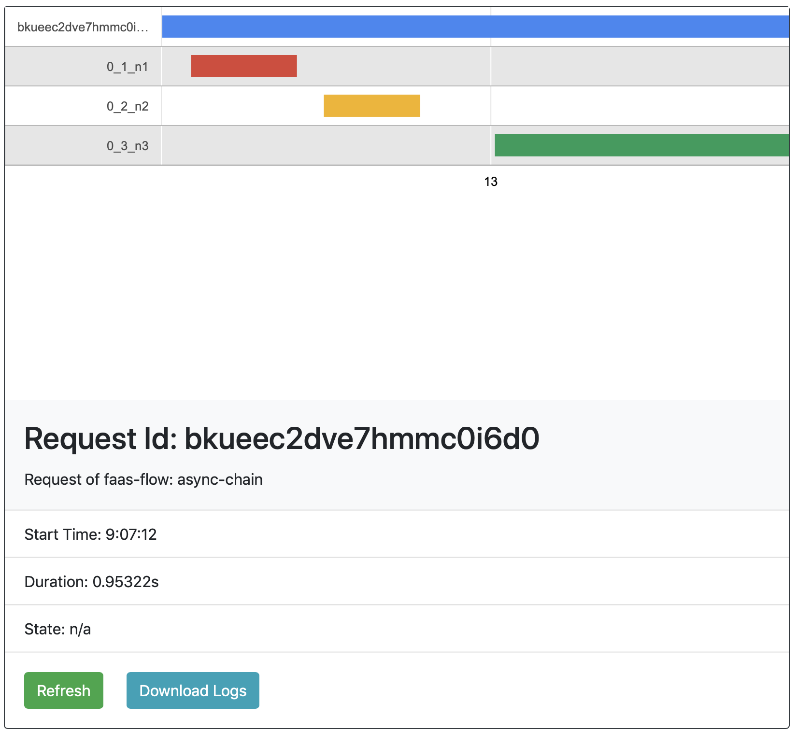
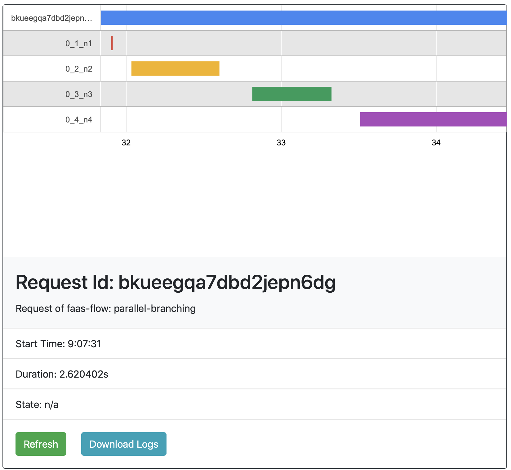
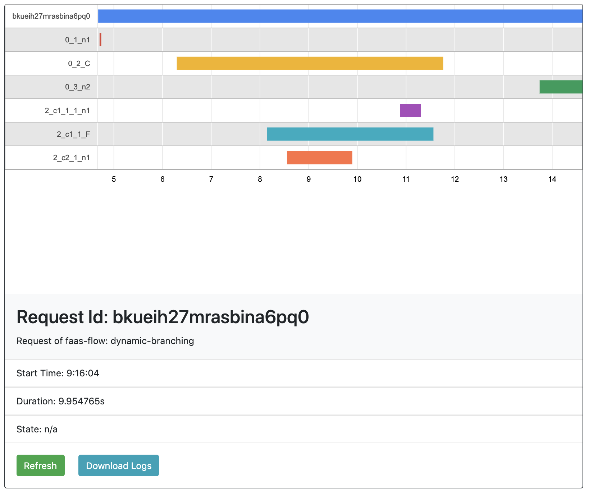
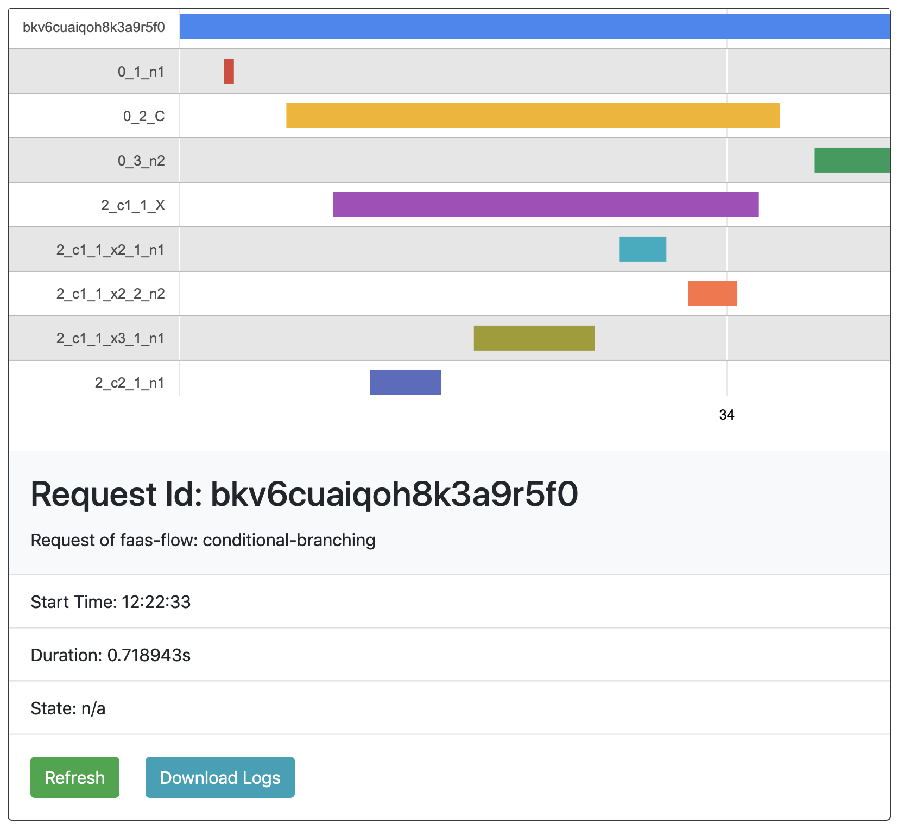

# faas-flow examples
Super simple examples of faas-flow

## Dags
> Sync Chain

> Async Chain

> Parallel Branching

> Dynamic Branching

> Conditional Branching 


## Getting Started 
1. Deploy Openfaas
2. Deploy Faasflow Infra (https://github.com/faasflow/faas-flow-infra#deploy-in-kubernetes)
3. Review your configuration at `flow.yml`
```yml
environment:
  gateway: "gateway.openfaas:8080"
  enable_tracing: true
  trace_server: "jaeger-agent.faasflow:5775"  
  enable_hmac: false
  consul_url: "consul.faasflow:8500"
  consul_dc: "dc1"
  s3_url: "minio.faasflow:9000"
  s3_tls: false
```
4. Deploy the flow-functions
```bash
faas deploy
```
5. Request the flows
```bash
curl -v http://127.0.0.1:8080/function/sync-chain
curl -v http://127.0.0.1:8080/function/async-chain
curl -v http://127.0.0.1:8080/function/parallel-branching
curl -v http://127.0.0.1:8080/function/dynamic-branching
curl -v http://127.0.0.1:8080/function/conditional-branching
``` 
6. Check the logs of storage function

## Tracing Information in faas-flow-tower
> Sync Chain 

> Async Chain

> Parallel Branching

> Dynamic Branching

> Conditional Branching

